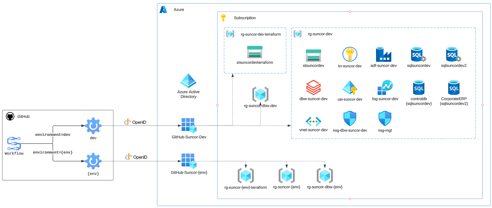

# Azure Data Platform

Uses industry best practices and Slalom accelerators to provide a migration target for the current Enterprise Data and Enterprise Analytics data platform environments.

## Platform Architecture



## Repository

The repository is organized into the following folders:

```
.
├── adf               # Azure Data Factory resources
├── Databricks        # Databricks notebooks
├── docs              # Documentation
├── terraform
│   ├── databricks    # Databricks workspace resources (not Azure resources)
│   ├── modules       # Shared Terraform modules
│   ├── platform      # Platform Azure resources
│   └── tf_backend    # Storage account for Terraform state
└── README.md
```

### Secrets

The repository has the following secrets:

- `AZURE_SUBSCRIPTION_ID` has the subscription ID of the Azure subscription
- `AZURE_TENANT_ID` has the tenant ID of the Azure subscription

### Environments

Each environment has specific protection rules, variables, and secrets. A workflow job that references an environment must follow any protection rules for the environment before running or accessing the environment's secrets.

Each environment has `AZURE_CLIENT_ID` secret which contains the client ID of the service principal that is used to deploy the Azure resources.

### Branches

- `main` branch is the main branch for the repository
- `hotfix` branch is a special branch that has protection rules similar to `main` branch but is used for production hotfixes

### Branch Protection Rules

The `main` and `hotfix` branches are protected and the following rules are applied:

- Require pull request reviews before merging
- Require at least 1 reviewer to approve pull requests
- Dismiss stale pull request approvals when new commits are pushed
- Require review from Code Owners ([`CODEOWNERS`](./.github/CODEOWNERS) file)
- Require approval of the most recent reviewable push
- Require status checks to pass before merging
- Require conversation resolution before merging
- Require branches to be up to date before merging

:bulb: You can use a [`CODEOWNERS`](./.github/CODEOWNERS) file to define individuals or teams that are responsible for code in a repository. Code owners are automatically requested for review when someone opens a pull request that modifies code that they own.

:rotating_light: Branches are automatically deleted after pull requests are merged.

## Platform Setup

See [Platform Setup](./docs/platform-setup.md) for more information on setting up the platform.

## DevOps

See [DevOps](./docs/devops.md) for more information on the DevOps process.
